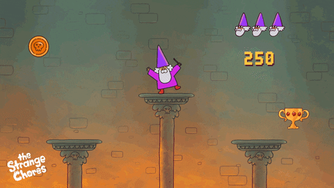

# Mini-level — Inleveren

**Naam:** <!-- jouw naam -->  
**Klas:** <!-- jouw klas -->
**Datum:** <!-- datum van inleveren -->  
**Les:** GDV Les 6

---

## Wat heb ik gemaakt?

<!-- Beschrijf kort je mini-level. Wat moet de speler doen? Wat is het doel? -->

...

---

## Screenshot / GIF van je level

<!-- Voeg hieronder een screenshot of een GIF toe van je werkende level.
     Sleep het bestand naar deze map en gebruik dan de syntax hieronder. -->



<!-- Tip: gebruik ShareX, LICEcap of de ingebouwde Xbox Game Bar (Win+G) om een GIF op te nemen. -->

---

## Bewegend object

<!-- Welk object beweegt en hoe heb je dat gedaan? -->

...

```csharp
// Plak hier het script of het stuk code dat het object laat bewegen.
void Update()
{

}
```

---

## Collider of trigger

<!-- Welk object heeft een collider of trigger, en wat gebeurt er? -->

...

```csharp
// Plak hier de OnCollisionEnter/OnTriggerEnter code die je hebt gebruikt.
private void OnTriggerEnter(Collider other)
{

}
```

---

## Logica met `if` of `switch`

<!-- Beschrijf kort welke keuze je hebt gemaakt (bijv. sleutel → deur open). -->

...

```csharp
// Plak hier het stuk code met jouw if- of switch-logica.
if ()
{

}
```

---

## Eigen extra idee

<!-- Wat is jouw eigen extra feature? Beschrijf wat het doet en hoe je het hebt gebouwd. -->

...

```csharp
// Optioneel: plak hier de bijbehorende code.

```

---

## Evaluatie

### Wat ging goed? en waarom?

<!-- Wat lukte je makkelijk of waar ben je trots op? -->

...

### Wat vond je lastig? en waarom?

<!-- Waar liep je tegenaan? Hoe heb je het opgelost (of niet)? -->

...

### Wat zou je een volgende keer anders doen?

<!-- Wat heb je geleerd? -->

...
