# Week 2 – LibreSprite downloaden, installeren en verkennen

## Doel

LibreSprite is het tekenprogramma waarmee je deze lessenreeks al je pixel art gaat maken. Deze week installeer je het programma en leer je de belangrijkste tools kennen. Aan het einde van de les kun je een eerste eigen character design maken.

---

## Stap 1 – LibreSprite downloaden

1. Ga naar [libresprite.github.io](https://libresprite.github.io/).

   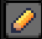

2. Klik op **Downloads**. Je wordt naar een **Releases** pagina gestuurd. Scroll naar beneden voor een lijst met downloads.

   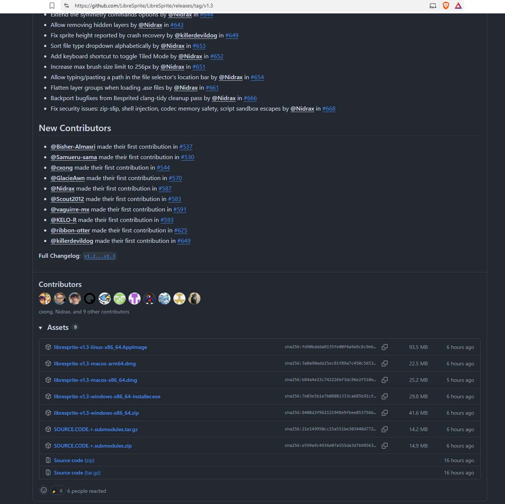

3. Download het bestand dat bij jouw besturingssysteem hoort:
   - **Windows**: een `.zip` bestand (portable) of een installer.
   - **macOS**: een `.dmg` bestand.
   - **Linux**: een `AppImage` of broncode om zelf te bouwen.

---

## Stap 2 – LibreSprite installeren

### Windows

1. Pak het gedownloade `.zip` bestand uit naar een map, bijvoorbeeld `C:\Programs\LibreSprite` (of run de installer als je die gedownload hebt).
2. Open de map en start `LibreSprite.exe`.
3. Krijg je een melding van Windows Defender (_"Windows protected your PC"_)? Klik op **Meer info > Toch uitvoeren**.

### macOS

1. Open het gedownloade `.dmg` bestand.
2. Sleep het LibreSprite-icoon naar de map **Applications**.
3. Krijg je een melding dat de app niet vertrouwd is? Ga naar **Systeemvoorkeuren > Beveiliging en privacy** en klik op **Toch openen**.

### Linux

1. Maak het AppImage-bestand uitvoerbaar: rechtsklik > **Eigenschappen > Permissions > Allow executing**.
2. Dubbelklik het bestand om LibreSprite te starten.

---

## Stap 3 – Eerste keer opstarten

1. Start LibreSprite.
2. Kies **File > New File** (of `Ctrl+N`).
3. Stel de **Canvas Size** in op de pixelgrootte die je voor je sprite gaat gebruiken (bijv. 16x16 of 32x32).
4. Klik op **OK** om een leeg canvas te openen.

   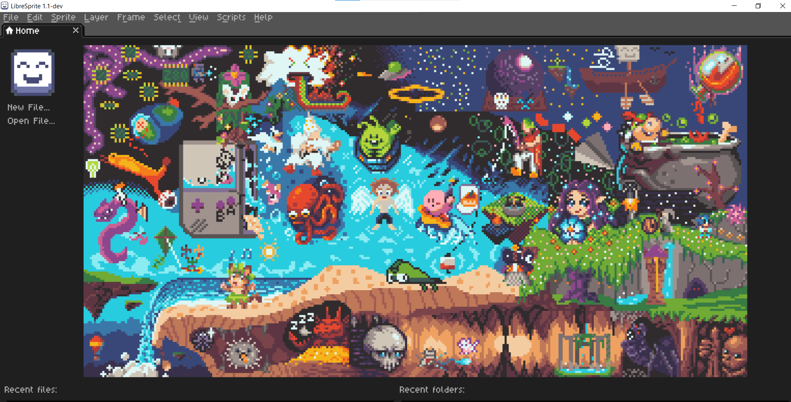

---

## Cheatsheet – Belangrijkste opties in LibreSprite

Gebruik dit overzicht als naslagwerk terwijl je aan het tekenen bent.

### Tekengereedschap

| Icoon                | Tool                          | Sneltoets                                      | Werkt als                                                            |
| -------------------- | ----------------------------- | ---------------------------------------------- | -------------------------------------------------------------------- |
|  | Pencil                        | `B`                                            | Tekent losse pixels in de gekozen kleur.                             |
| 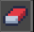 | Eraser                        | `E`                                            | Wist pixels (maakt ze transparant).                                  |
| 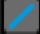 | Line                          | `L`                                            | Tekent een rechte lijn.                                              |
| 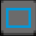 | Rectangle / Ellipse           | `U`                                            | Tekent een rechthoek of ellips (ingedrukt houden voor meer opties).  |
| 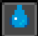 | Bucket Fill                   | `G`                                            | Vult een aaneengesloten gebied met de gekozen kleur.                 |
| 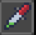 | Eyedropper                    | `I` (of `Alt` ingedrukt houden)                | Neemt een kleur over van het canvas.                                 |
| 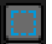 | Rectangular / Lasso Selection | `M`                                            | Selecteert een deel van het canvas om te verplaatsen of te bewerken. |
| 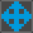 | Move                          | `V`                                            | Verplaatst de selectie of laag.                                      |
| 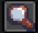 | Zoom                          | `Z` (of scrollwiel)                            | In- en uitzoomen op het canvas.                                      |
| —                    | Pan (canvas verslepen)        | Spatie of scrollwiel ingedrukt houden + slepen | Verschuift je weergave zonder te tekenen.                            |

### Kleuren

- **Color Palette** (onderaan/zijkant): kies of sla kleuren op die je vaak gebruikt.
- **Foreground/Background color**: klik met links voor voorgrondkleur, rechts voor achtergrondkleur.
- **Palette > Load Palette**: laad een kant-en-klare kleurenpalet (handig voor een consistente pixel-art stijl).

### Lagen (Layers)

- **Window/paneel Layers**: toont alle lagen van je sprite.
- **New Layer**: voeg een laag toe om bijvoorbeeld de outline los te houden van de inkleuring.
- **Visibility (oog-icoon)**: verberg een laag tijdelijk zonder hem te verwijderen.

### Animatie (Frames & Onion Skinning)

- **Timeline onderaan**: toont alle frames van je animatie.
- **New Frame**: voegt een nieuw, leeg frame toe.
- **Duplicate Frame**: kopieert het huidige frame (handig als basis voor de volgende pose).
- **Onion Skinning** (knop in de timeline): toont het vorige/volgende frame licht doorschijnend, zodat je vloeiend kunt animeren.
- **Play (▶ in de timeline)**: speelt je animatie af ter controle.

### Canvas & export

- **Sprite > Canvas Size**: wijzigt de afmeting van het canvas (voegt lege ruimte toe of snijdt af).
- **Sprite > Sprite Size**: schaalt de hele sprite naar een andere pixelgrootte.
- **File > Export Sprite Sheet**: exporteert al je frames als één spritesheet-afbeelding, klaar om in Unity te slicen.
- **File > Save As** (`Ctrl+Shift+S`): sla je werkbestand op als `.ase`/`.aseprite` zodat je later nog kunt bewerken.

### Algemene sneltoetsen

| Actie              | Sneltoets           |
| ------------------ | ------------------- |
| Nieuw bestand      | `Ctrl+N`            |
| Opslaan            | `Ctrl+S`            |
| Ongedaan maken     | `Ctrl+Z`            |
| Opnieuw            | `Ctrl+Y`            |
| Kopiëren / Plakken | `Ctrl+C` / `Ctrl+V` |
| Alles selecteren   | `Ctrl+A`            |

---

## Opdracht

Maak in tweetallen een character design voor:

- **De player**: 32 pixels breed, 64 pixels hoog.
- **De boss**: 64 of 128 pixels breed, 64 of 128 pixels hoog.

Deze twee characters gebruik je later in de lessenreeks om te animeren en in Unity te verwerken.

---

## Oplevering

1. LibreSprite werkt op je eigen laptop.
2. Je hebt een player character design gemaakt in LibreSprite (32x64 pixels).
3. Je hebt een boss character design gemaakt in LibreSprite (64/128 x 64/128 pixels).

Lever je character designs in op **Simulise**.
