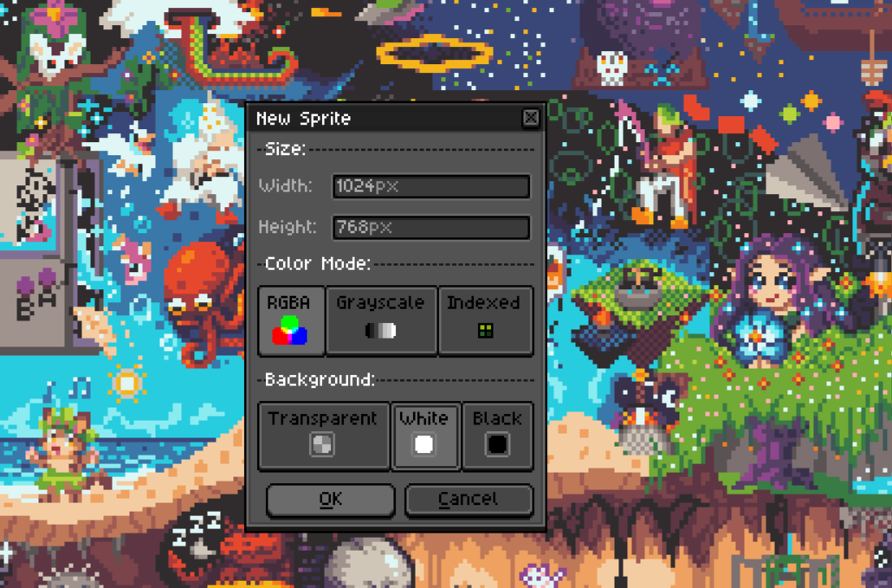
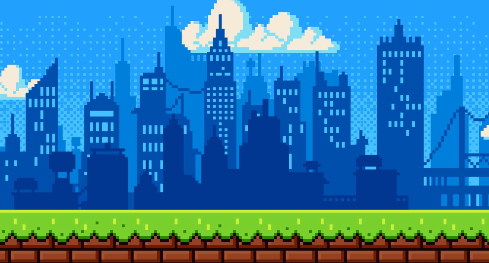
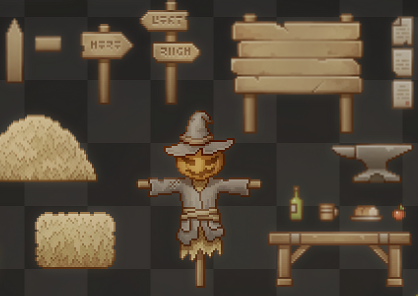

# Week 3 – Achtergrond en Props tekenen

## Doel

Deze week geef je jullie level een eigen wereld: je tekent een achtergrond en een setje props (losse objecten/decoratie) in LibreSprite. Aan het einde heb je een achtergrond van 1024x768 pixels en een aantal props die je in Week 6 in Unity kunt plaatsen.

---

## Stap 1 – Nieuw bestand opzetten voor de achtergrond

1. Open LibreSprite en kies **File > New File** (of `Ctrl+N`).
2. Stel de **Canvas Size** in op `1024 x 768` pixels.
3. Kies **Background Color: Transparent** als je de achtergrond later in lagen (parallax) wilt kunnen opbouwen, of **White**/een egale kleur als je direct 1 vlak tekent.
4. Klik op **OK**.

---

## Stap 2 – Achtergrond tekenen

1. Denk na over de setting die past bij de player en boss die je in Week 2 hebt getekend (bijv. grot, bos, kasteel, ruimteschip).
2. Werk met meerdere lagen (zie **Cheatsheet > Lagen** in [Week 2](../week%202%20-%20Libre%20Sprite/README.md)), bijvoorbeeld:
   - `Lucht` (verste laag, lucht/wolken/sterren).
   - `Achtergrond` (bergen, gebouwen, bomen in de verte).
   - `Vloer` (de grond waar het level straks op gebouwd wordt).
3. Teken eerst grof de compositie (blocking): waar komt de horizon, waar is het donker/licht.
4. Werk daarna de details uit per laag.
5. Gebruik **Palette > Load Palette** om hetzelfde kleurenpalet te gebruiken als bij je characters, zodat alles visueel bij elkaar past.
6. Sla je werkbestand op (`Ctrl+S`) en exporteer de achtergrond als PNG via **File > Export As**.

---

## Stap 3 – Props tekenen

Props zijn losse objecten die je straks los in het level neerzet, bijvoorbeeld kisten, planten, lantaarns, stenen, vaten of andere decoratie.

1. Bepaal per prop een afmeting tussen **32x32** en **64x64** pixels. Gebruik veelvouden van 16 (`32x32`, `32x48`, `48x48`, `64x64`, etc.), zodat ze straks netjes passen op het tile-grid uit [Week 4](../week%204%20-%20tile%20map%20in%20Unity/README.md).
2. Maak per prop een nieuw bestand: **File > New File** met de gekozen afmeting en een **transparante achtergrond**.
3. Teken de prop met een duidelijk silhouet: een prop moet ook herkenbaar zijn als je alleen naar de vorm kijkt, zonder details.
4. Gebruik dezelfde kleurenpalet als je achtergrond en characters.
5. Herhaal dit voor minimaal **5 verschillende props**, met wat variatie in grootte.
6. Exporteer elke prop los als PNG via **File > Export As**, of verzamel ze samen op één sprite sheet via **File > Export Sprite Sheet** (zie de cheatsheet in Week 2).

---

## Opdracht

Maak in tweetallen:

1. Eén achtergrond van **1024x768** pixels, passend bij jullie spelconcept.
2. Minimaal **5 props**, elk tussen **32x32** en **64x64** pixels (veelvoud van 16), met wat variatie in afmeting.

---

## Oplevering

1. Eén achtergrond-sprite van 1024x768 pixels.
2. Minimaal 5 prop-sprites, elk tussen 32x32 en 64x64 pixels.

Lever je achtergrond en props in op **Simulise**.
