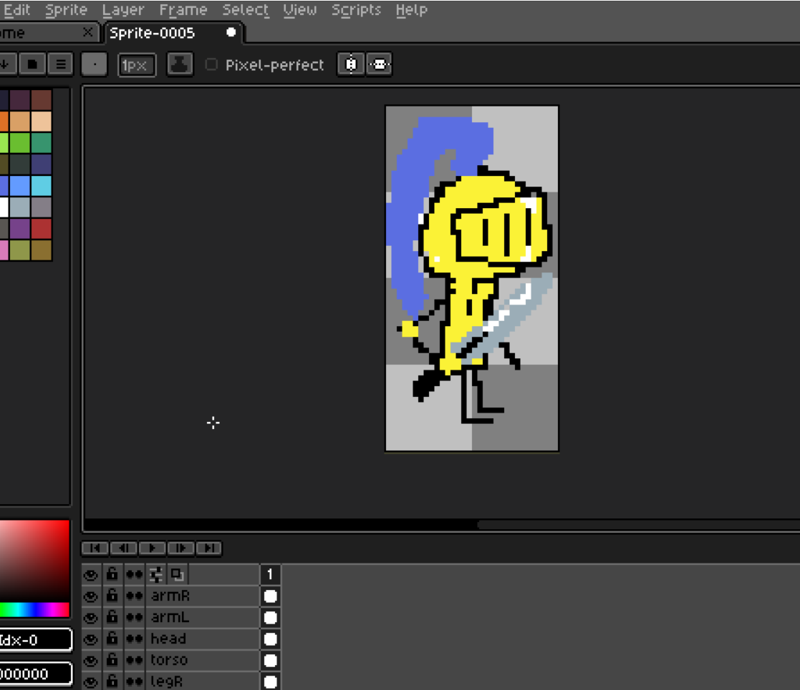
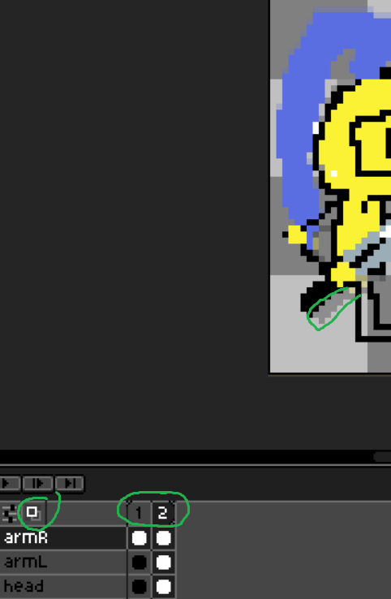
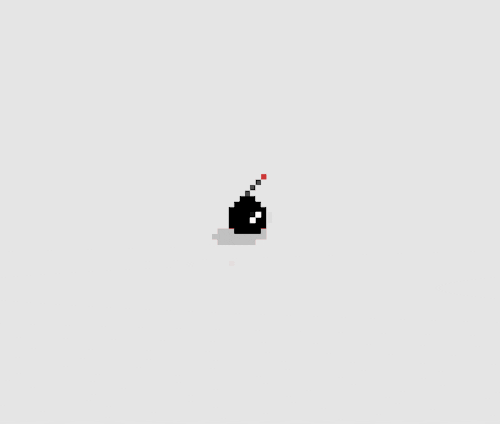
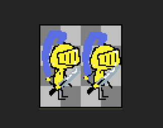

# Week 5 – Animaties tekenen

## Doel

Deze week breng je de player en de boss tot leven. Je gebruikt de Timeline en Onion Skinning uit LibreSprite (zie de cheatsheet in [Week 2](../week%202%20-%20Libre%20Sprite/README.md)) om animaties te tekenen voor je characters en hun projectielen.

---

## Stap 1 – Werkbestand voorbereiden

1. Open het bestand met je player character (uit Week 2).
2. Zorg dat de **Canvas Size** exact de afmeting van 1 animatie-frame is (bijv. 32x64 voor de player). Elk frame moet dezelfde afmeting houden, anders "springt" je animatie later in Unity.
3. Werk eventueel met losse lagen (outline, inkleuring) zodat je makkelijker kunt bijsturen tijdens het animeren.

---

## Stap 2 – Frames en Onion Skinning gebruiken

1. Open de **Timeline** onderin het scherm.
2. Gebruik **New Frame** om een leeg frame toe te voegen, of **Duplicate Frame** om het huidige frame als basis te gebruiken voor de volgende pose.
3. Zet **Onion Skinning** aan (knop in de timeline): je ziet dan het vorige/volgende frame licht doorschijnend, zodat je vloeiend kunt doortekenen.
4. Klik op **Play (▶)** in de timeline om je animatie steeds even te testen.
5. Rechtsklik op een reeks frames in de timeline en kies **New Tag** om een naam te geven aan een animatie (bijv. `idle`, `walk`). Zo kun je straks per animatie exporteren.

---

## Stap 3 – Player animaties tekenen

Maak voor de player minimaal de volgende animaties:

| Animatie | Omschrijving                               | Richtlijn aantal frames |
| -------- | ------------------------------------------ | ----------------------- |
| `idle`   | Rustige, lichte beweging (bv. ademhaling). | 2-4                     |
| `walk`   | Loopcyclus.                                | 4-8                     |
| `jump`   | Opstijgen, in de lucht, landen.            | 2-4                     |
| `shoot`  | Het afvuren van een projectiel.            | 2-3                     |

---

## Stap 4 – Boss animaties tekenen

Maak voor de boss minimaal de volgende animaties:

| Animatie | Omschrijving                    | Richtlijn aantal frames |
| -------- | ------------------------------- | ----------------------- |
| `idle`   | Rustige stand van de boss.      | 2-4                     |
| `walk`   | Verplaatsing van de boss.       | 4-8                     |
| `shoot`  | Het afvuren van een projectiel. | 2-3                     |

---

## Stap 5 – Projectielen animeren

Teken een korte animatie (2-4 frames) voor:

1. Het projectiel van de **player** (bijv. een vuurbal die flikkert of ronddraait).
2. Het projectiel van de **boss**.

Houd de canvasgrootte van projectielen klein en consistent, bijvoorbeeld 16x16 of 32x32.

---

## Stap 6 – Exporteren

1. Selecteer de animatie-tag die je wilt exporteren.
2. Ga naar **File > Export Sprite Sheet**.
3. Laat elk frame exact de canvas-afmeting behouden (zet **Trim** uit), zodat de frames straks in Unity netjes op hun plek blijven staan.
4. Exporteer de spritesheet (en eventueel een `.json` met frame-data) per animatie, of per character.

---

## Tips

- Houd elk frame binnen dezelfde canvasgrootte; wisselende canvasgroottes geven "jitter" zodra je de animatie in Unity afspeelt.
- Test je animatie vaak met **Play (▶)** in de timeline in plaats van pas aan het einde.
- Gebruik **Onion Skinning** vooral bij de `walk`-cyclus om vloeiende overgangen tussen frames te maken.
- Blijf dezelfde **Pixels Per Unit** en hetzelfde kleurenpalet gebruiken als in Week 2 en Week 3.

---

## Opdracht

Maak in tweetallen:

1. Player-animaties: `idle`, `walk`, `jump`, `shoot`.
2. Boss-animaties: `idle`, `walk`, `shoot`.
3. Twee projectiel-animaties (één voor de player, één voor de boss).

---

## Oplevering

1. Spritesheet(s) van de player-animaties.
2. Spritesheet(s) van de boss-animaties.
3. Spritesheet(s) van beide projectielen.

Lever je animaties in op **Simulise**.
