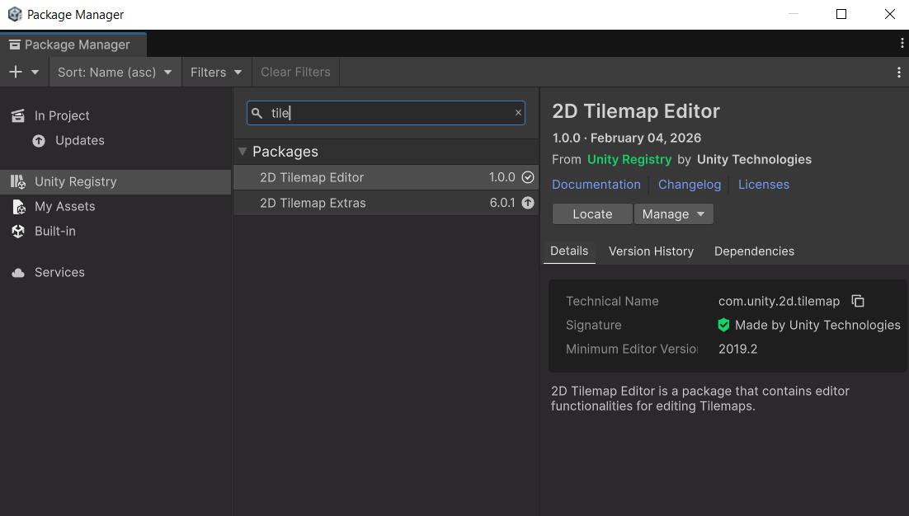
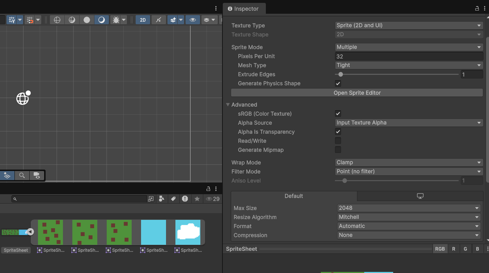
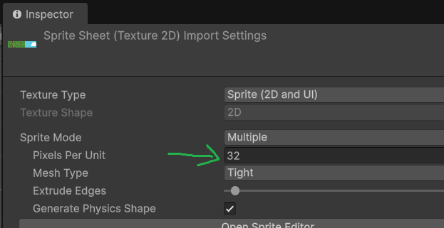
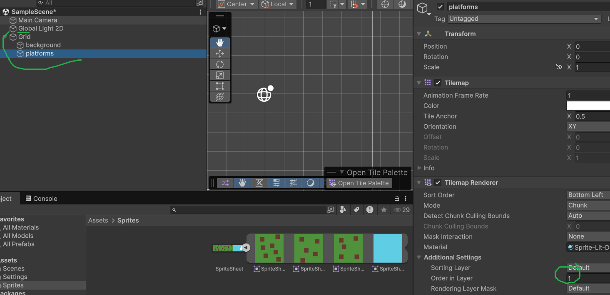
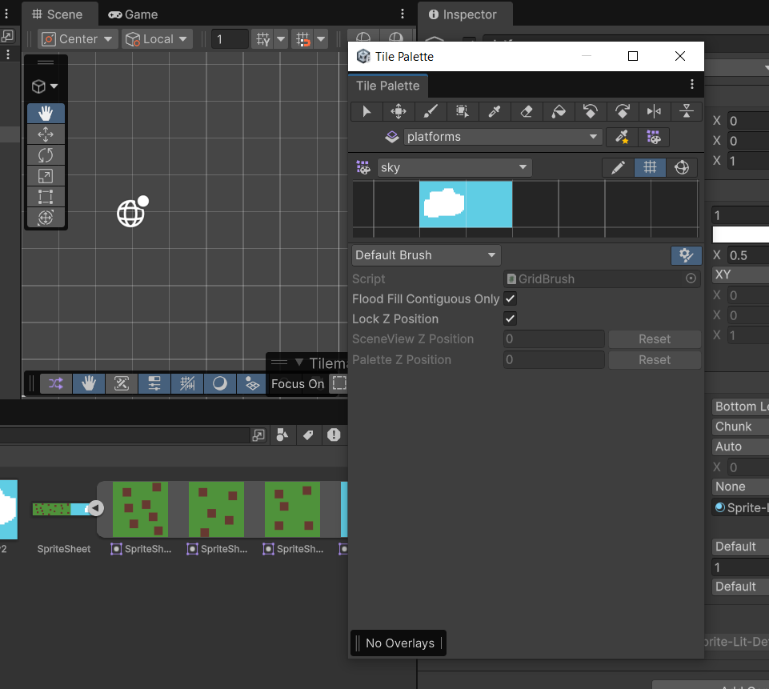
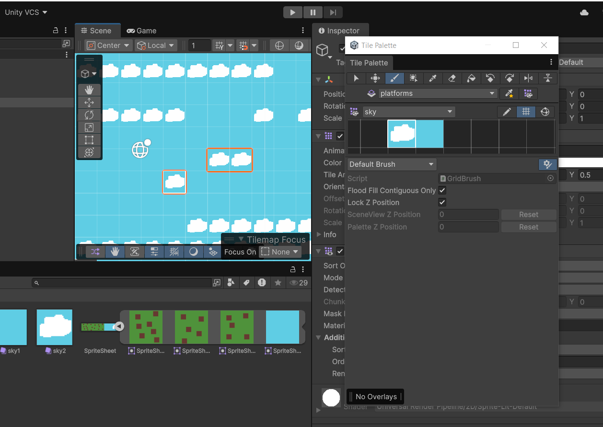
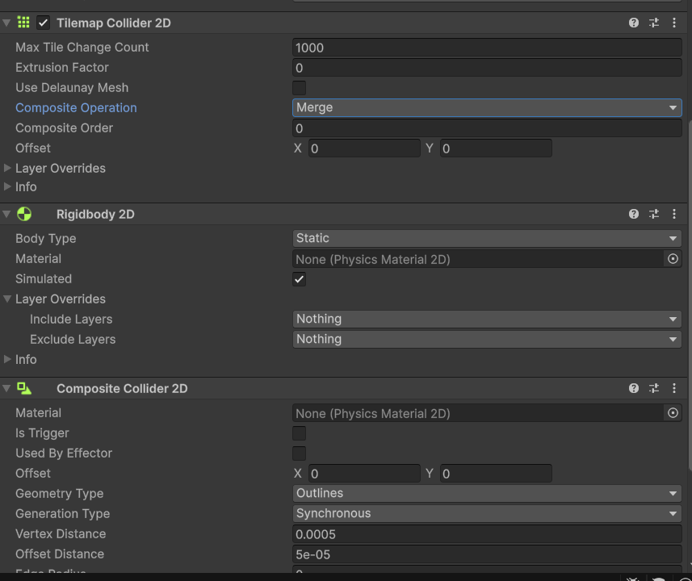
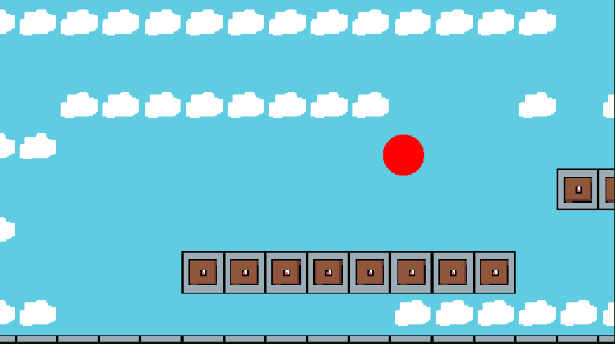

# Week 4 – Tilemap in Unity

## Doel

Je leert hoe je een Tilemap opzet in Unity en hoe je daarmee een level bouwt met de tiles die je zelf hebt getekend.

---

## Stap 0 – 2D Tilemap package installeren (niet nodig als je een 2d project hebt)

1. Open **Window > Package Manager**.
2. Zoek naar **2D Tilemap Editor** (zit meestal al bij een 2D project) en klik op **Install**.
3. Controleer dat je ook de **2D Tilemap Extras** hebt geïnstalleerd (voor Rule Tiles e.d.).

---

## Stap 1 – Je tile sprites voorbereiden

1. Sleep je sprite sheet (.png) met level tiles in de map `Assets/Sprites`.
2. Selecteer de sprite in de Project view en zet in de **Inspector**:
   - **Sprite Mode**: `Multiple`
   - **Pixels Per Unit**: zelfde waarde als je andere sprites (consistent houden!)
   - **Filter Mode**: `Point (no filter)` (voorkomt vaag worden van pixel art)
   - **Compression**: `None`
3. Klik op **Open Sprite Editor** en gebruik **Slice** om de sheet op te splitsen in losse tiles.
4. Klik op **Apply**.

---

## Stap 2 – Tiles op de juiste grootte van 1 cel krijgen

Een tile moet precies 1 grid cel vullen, anders lopen je tiles niet mooi aan elkaar in de Tilemap.

1. Bepaal de pixelgrootte van 1 tile in je sprite sheet, bijvoorbeeld 16x16 of 32x32 pixels.
2. Selecteer de sprite in de Project view en zet in de **Inspector** de **Pixels Per Unit** gelijk aan die pixelgrootte (bijv. 16 bij tiles van 16x16 pixels). Zo komt 1 tile overeen met exact 1 Unity-unit.
3. Klik op **Apply** om de wijziging op te slaan.
4. Selecteer in de Hierarchy je `Grid` object en controleer dat de **Cell Size** op `X=1, Y=1, Z=0` staat (de standaardwaarde).
5. Sleep een tile in de Scene view en controleer dat deze precies binnen 1 cel van het grid past (zichtbaar als dun raster in de Scene view). Past de tile niet exact, controleer dan of de Pixels Per Unit en de Slice-grootte uit stap 1 kloppen.

---

## Stap 3 – Tilemap aanmaken in de scene

1. Rechtsklik in de **Hierarchy** > **2D Object > Tilemap > Rectangular** (of Hexagonal/Isometric als je level dat nodig heeft).
   - Dit maakt automatisch een `Grid` object aan met daaronder een `Tilemap`.
2. Hernoem de Tilemap naar iets duidelijks, bijvoorbeeld `Tilemap_Ground`.
3. Maak voor overzicht meerdere tilemaps aan onder dezelfde Grid, bijvoorbeeld:
   - `Tilemap_Background`
   - `Tilemap_Ground`
   - `Tilemap_Props`
4. Zet de **Order in Layer** van elke Tilemap goed (hoger = meer op de voorgrond) via de `Tilemap Renderer`.

---

## Stap 4 – Tile Palette aanmaken

1. Open **Window > 2D > Tile Palette**.
2. Klik op **Create New Palette**, geef een naam en kies een opslaglocatie (bijv. `Assets/Tiles`).
3. Sleep je uitgesneden tile sprites vanuit de Project view in het Tile Palette venster.
   - Unity vraagt om een map waarin de losse `.asset` tile-bestanden worden opgeslagen.

---

## Stap 5 – Level schilderen

1. Selecteer de juiste Tilemap in de Hierarchy (bijv. `Tilemap_Ground`) zodat je daar op tekent.
2. Kies in het Tile Palette venster het gereedschap:
   - **Paint (P)** – tiles plaatsen
   - **Erase (E)** – tiles verwijderen
   - **Box Fill (U)** – een rechthoekig gebied vullen
   - **Picker (I)** – een tile overnemen die al in de scene staat
3. Klik/sleep in de Scene view om tiles te plaatsen.
4. Herhaal voor elke laag (background, ground, props) met de bijbehorende Tilemap geselecteerd.

---

## Stap 6 – Collision toevoegen

1. Selecteer de Tilemap waar de speler tegenaan moet botsen (bijv. `Tilemap_Ground`).
2. Voeg de volgende componenten toe via **Add Component**:
   - **Tilemap Collider 2D**
   - **Composite Collider 2D** (voorkomt losse colliders per tile en maakt botsing vloeiender)
3. Zorg dat de `Tilemap Collider 2D` wordt meegenomen door de `Composite Collider`:
   Zet de dropdown **Composite Operation** op `Merge`.
4. Unity voegt zelf een **Rigidbody 2D** toe aan de Tilemap. Zet nu zelf hiervan de **Body Type** op `Static`.

---

## Stap 7 – Collision testen

1. Maak een test-object: rechtsklik in de **Hierarchy** > **2D Object > Sprites > Circle**.
2. Hernoem het object naar bijvoorbeeld `TestBall` en zet het via de **Transform** boven je level, zodat het naar beneden kan vallen.
3. Voeg via **Add Component** een **Rigidbody 2D** toe aan `TestBall`, zodat zwaartekracht erop werkt.
4. Voeg via **Add Component** een **Circle Collider 2D** toe aan `TestBall`, zodat het kan botsen met de Tilemap.
5. Druk op **Play**.
6. Controleer of `TestBall` naar beneden valt en blijft liggen op `Tilemap_Ground`, in plaats van erdoorheen te vallen.
7. Werkt de collision niet zoals verwacht? Controleer dan het volgende:
   - Staat bij de `Tilemap Collider 2D` de **Composite Operation** op `Merge` (zie Stap 6)?
   - Heeft de Tilemap een `Rigidbody 2D` met **Body Type** op `Static`?
   - Heeft `TestBall` zowel een `Rigidbody 2D` als een `Circle Collider 2D`?
   - Staat `TestBall` bij het starten van Play Mode echt boven het level en niet erin vast?

---

## Tips

- Gebruik aparte Tilemaps per laag zodat je background, ground en props los kunt aanpassen.
- Houd je **Pixels Per Unit** en **Grid Cell Size** op elkaar afgestemd, anders passen tiles niet netjes in het grid.
- Gebruik **Rule Tiles** (via 2D Tilemap Extras) als je automatisch overgangen tussen tiles wilt (bijv. randen van platforms).
- Sla je Tile Palette op in de projectmap zodat je teamgenoot deze ook kan gebruiken.

---

## Oplevering

Een Unity scene met:

1. Een werkend Tilemap-level gebouwd uit je eigen tiles.
2. Minimaal een background- en een ground-laag.
3. Werkende collision op de ground-laag.

Lever een gifje of video van je level en toon aan dat de collision werkt. Lever deze gif of video in op **Simulise**.
