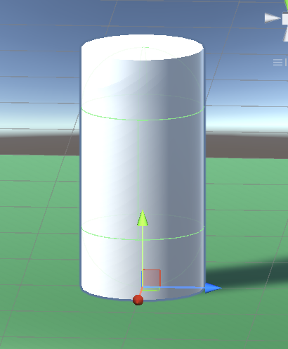
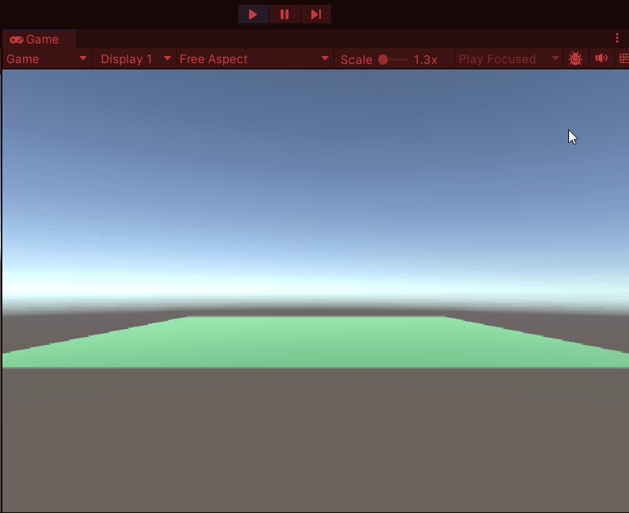

# M4 PROG 01 – Variabelen, Functies, Classes en Arrays

## Introductie

In deze les haal je de belangrijkste kennis uit leerjaar 1 weer op. Je oefent met variabelen, functies, classes, arrays en Lists in C# en Unity.

De opdrachten vormen ook een nulmeting. Zo krijgt de docent een beeld van jouw huidige niveau en van de onderwerpen waarbij je eventueel extra uitleg of oefening nodig hebt.

## Theorie

### Variabelen

Een variabele slaat een waarde op onder een naam. Je geeft altijd het **type** aan.

```csharp
int score = 10;
string naam = "Speler1";
bool leeft = true;
```

Veelgebruikte types: `int` (geheel getal), `float` (decimaal), `string` (tekst), `bool` (waar/niet-waar).

#### Overzicht veelgebruikte datatypes

| Type      | Omschrijving                         | Voorbeeld                                |
| --------- | ------------------------------------ | ---------------------------------------- |
| `int`     | Geheel getal (32-bit)                | `int score = 42;`                        |
| `float`   | Decimaal getal (32-bit, ~7 cijfers)  | `float snelheid = 3.5f;`                 |
| `double`  | Decimaal getal (64-bit, ~15 cijfers) | `double afstand = 1.234567890;`          |
| `bool`    | Waar of niet-waar                    | `bool isActief = true;`                  |
| `string`  | Tekst (reeks tekens)                 | `string naam = "Speler";`                |
| `char`    | Eén enkel teken                      | `char letter = 'A';`                     |
| `long`    | Groot geheel getal (64-bit)          | `long punten = 9999999999L;`             |
| `byte`    | Klein geheel getal (0–255)           | `byte niveau = 3;`                       |
| `uint`    | Positief geheel getal (0–4 miljard)  | `uint stappen = 100000u;`                |
| `Vector2` | 2D-positie (Unity)                   | `Vector2 pos = new Vector2(1f, 2f);`     |
| `Vector3` | 3D-positie (Unity)                   | `Vector3 pos = new Vector3(0f, 1f, 0f);` |

---

### Functies

Een functie is een herbruikbaar stuk code. Je geeft aan wat hij **teruggeeft** en welke **parameters** hij nodig heeft.

```csharp
int Optellen(int a, int b)
{
    return a + b;
}

int resultaat = Optellen(3, 5); // resultaat = 8
```

Gebruik `void` als de functie niets teruggeeft.

---

### Classes

Een class is een **blauwdruk** voor een object. Een object is een instantie van die class.

```csharp
class Vijand
{
    public string Naam;
    public int HP;

    public void Aanval()
    {
        Console.WriteLine(Naam + " valt aan!");
    }
}

Vijand v = new Vijand();
v.Naam = "Goblin";
v.HP = 50;
v.Aanval();
```

---

### Instantiate in Unity

Met `Instantiate` maak je tijdens het spelen een kopie van een GameObject, meestal van een prefab. De methode geeft het nieuwe GameObject terug, zodat je het verder kunt gebruiken.

```csharp
public GameObject vijandPrefab;

void Start()
{
    GameObject nieuweVijand = Instantiate(
        vijandPrefab,
        new Vector3(0f, 0f, 0f),
        Quaternion.identity
    );
}
```

Sleep het prefab in de Inspector naar `vijandPrefab`. `Instantiate` maakt dan bij het starten van de scene een kopie op de opgegeven positie en met de opgegeven rotatie.

---

### Arrays

Een array slaat meerdere waarden van hetzelfde type op in één variabele.

```csharp
int[] scores = new int[3];
scores[0] = 10;
scores[1] = 20;
scores[2] = 30;

// Of direct initialiseren:
string[] namen = { "Alice", "Bob", "Charlie" };

// Doorlopen met een lus:
for (int i = 0; i < namen.Length; i++)
{
    Console.WriteLine(namen[i]);
}
```

---

### Lists<type>

Een `List<type>` lijkt op een array, maar de lijst kan tijdens het spel groter of kleiner worden. Gebruik `List<T>` uit `System.Collections.Generic`.

```csharp
using System.Collections.Generic;

List<GameObject> vijanden = new List<GameObject>();

vijanden.Add(eersteVijand);
vijanden.Add(tweedeVijand);

foreach (GameObject vijand in vijanden)
{
    Debug.Log(vijand.name);
}

Debug.Log(vijanden.Count); // aantal vijanden
vijanden.Remove(eersteVijand);
```

Bij een array gebruik je `Length`; bij een `List<type>` gebruik je `Count`. Een lijst is in Unity handig wanneer je bijvoorbeeld vijanden tijdens het spelen wilt toevoegen of verwijderen.

---

## Opdrachten

Maak een nieuw .cs script aan en noem die `PROG_Les1.cs`

Gebruik deze code zodat je je script vanaf de commandline kunt runnen

```csharp
class PROG_Les1
{
    static void Main(string[] args)
    {

    }
}
```

Gebruik het commando `C:\> dotnet PROG_Les1.cs` om je code te compilen en te runnen.

Let op: opdrachten 1.1 t/m 1.11 voer je uit op de command line en opdracht 1.12 in Unity.

---

### Opdracht 1.1 – Variabelen: Spelersnaam en Score

Maak drie variabelen aan:

- een `string` voor de naam van de speler
- een `int` voor de score
- een `bool` die bijhoudt of de speler nog leeft

Print de waarden naar de console.

```
voorbeeld output>
Naam : Erwin
Score : 1000
Alive : True
```

---

### Opdracht 1.2 – Variabelen: Berekening met HP

De speler heeft 100 HP. Hij wordt geraakt voor 35 schade. Bereken de resterende HP en druk die af.  
Gebruik daarna een tweede aanval van 80 schade. Druk af of de speler nog leeft (`HP > 0`).

```
voorbeeld output>
HP : 65
Speler Leeft nog!
```

---

### Opdracht 1.3 – Functies: Begroeting

Schrijf een functie `Begroet(string naam)` die "Welkom, [naam]!" afdrukt.  
Roep de functie aan met je eigen naam.

```
voorbeeld output>
Welkom Erwin!
```

---

### Opdracht 1.4 – Functies: Max van twee getallen

Schrijf een functie `int Max(int a, int b)` die het grootste van twee getallen teruggeeft.  
Test de functie met een paar waarden en druk het resultaat af.

```
voorbeeld output>
Result : 40
Result : 60
```

---

### Opdracht 1.5 – Functies: Schade berekenen

Schrijf een functie `int BerekenSchade(int aanval, int verdediging)` die `aanval - verdediging` teruggeeft (minimaal 0).  
Roep de functie aan en druk de schade af.

```
voorbeeld output>
schade : 1000
```

---

### Opdracht 1.6 – Arrays: Vijanden

Maak een array van vijf vijandnamen (strings).  
Druk alle namen af met een `for`-lus.

```
voorbeeld output>
Orc
Knight
Wizard
Ogre
Dragon
```

---

### Opdracht 1.7 – Arrays: Hoogste score

Maak een array van vijf scores (integers).  
Schrijf code die de hoogste score vindt en afdrukt.

```
voorbeeld output>
highest : 10000
```

---

### Opdracht 1.8 – Classes: Speler

Maak een class `Speler` met de volgende velden:

- `string Naam`
- `int HP`
- `int Score`

Maak 2 object aan van deze class, vul de velden in en druk ze af.

```
voorbeeld output>
Speler.name : Mario
Speler.HP : 10
Speler.Score : 1000

Speler.name : Luigi
Speler.HP : 4
Speler.Score : 500
```

---

### Opdracht 1.9 – Classes: Methode toevoegen

Breid de `Speler`-class uit met een methode `Vertel()` die een zin naar de console schrijft zoals:  
`"Ik ben [Naam], mijn HP is [HP] en mijn score is [Score]."`

Roep de methode aan voor beide objecten uit opdracht 1.8.

```
voorbeeld output>
Ik ben Mario, mijn HP is 10 en mijn score is 1000.
Ik ben Luigi, mijn HP is 4 en mijn score is 500.
```

---

### Opdracht 1.10 – Combinatie: Array van Spelers

Maak een array van drie `Speler`-objecten. Geef elk een naam, HP en score.  
Schrijf een functie `DrukSpelersAf(Speler[] spelers)` die voor elke speler `Vertel()` aanroept.

```
voorbeeld output>
Ik ben Mario, mijn HP is 10 en mijn score is 1000.
Ik ben Luigi, mijn HP is 4 en mijn score is 500.
Ik ben Peach, mijn HP is 8 en mijn score is 800.
```

---

### Opdracht 1.11 – Lists: Vijanden

Gebruik `List<string>` om een lijst met vijandnamen te maken. Voeg vijf namen toe met `Add()`, verwijder één naam met `Remove()` en druk de overgebleven namen af met een `foreach`-lus. Druk ook het aantal vijanden af met `Count`.

```csharp
using System.Collections.Generic;
```

---

### Opdracht 1.12 – Instantiate in Unity

Maak nu in Unity een project aan met de naam `M5 PROG` maak voor deze opdracht een nieuwe scene aan. Noem deze: `Spawn Towers`

Maak een script aan met daarin de class **TowerSpawner**. Zet dit script op je Camera of een ander leeg gameobject in je scene.

Maak ook een prefab van een toren (dit mag ook een cylinder zijn). Zorg dat de base van de toren de zelfde positie heeft als de prefab. door de cilinder binnen de prefab te verplaatsen naar het pivot point.


Zorg voor een **Tower** class als script op je prefab. In de Start method van de **Tower** class geef je de toren een randomized Scale.

```csharp
    float x = Random.Range(0f,1f);
    float y = Random.Range(0f,1f);
    float z = Random.Range(0f,1f);

    transform.localScale = new Vector3(x,y,z);

```

Elke toren die je plaatst moet dus een andere size hebben.

Scrijf ook een script met de class `TowerSpawner`.

Zorg dat deze class elke keer als je in het scherm klikt een toren Instantieert op een willekeurige positie op de X- en Y-as.

Gebruik hiervoor de methode `Instantiate();`



### Werk inleveren

Push alle opdrachten die je deze periode voor module 5 (M5) maakt naar één repository.

Voeg in deze repository een README toe. Beschrijf in de README elke opdracht met:

- Titel van de opdracht
- een korte uitleg van wat je hebt gedaan;
- een korte evaluatie, wat ging goed? wat was lastig?
- een gifje van het resultaat;
- een link naar de bijbehorende code.

Lever de link naar de repository en de README éénmalig in via Simulise.

De deadline is 00:00 uur 's nachts op de dag vóór de volgende les. (komende woensdag dus)
