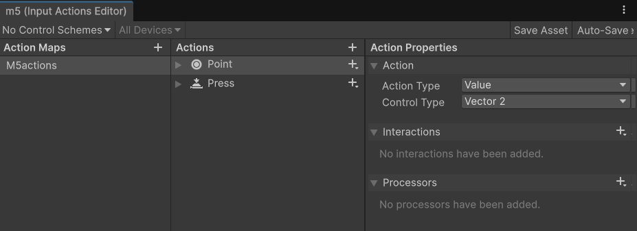

# toepassing: Vectoren optellen, aftrekken en scalair vermenigvuldigen

## Leerdoelen
Na deze les kun je:
- Laten zien dat je kan Werken met Unity input actions
- Laten zien dat je met Unity vectoren kan optellen, aftrekken en scalair vermenigvuldigen

---

## Opzetten van basis

We gaan eerst in Unity een basis opzetten, waarmee wij kunnen gaan werken met vectoren en matrices. Daarvoor hebben wij twee prefab-ojecten nodig:

1. Een draggable Point (een versleepbare punt)
2. Een triangle (driehoek) die uit drie draggable points bestaat

# draggable point


Maak eerst een nieuw Action input met als naam m5actions, met de actions Point en Press


``` cs
using UnityEngine;
using UnityEngine.InputSystem;

public class DraggablePoint : MonoBehaviour
{
    [SerializeField] InputActionReference pointAction;
    [SerializeField] InputActionReference pressAction;
    private bool isDragging = false;
    void Start()
    {

    }

    private void OnEnable()
    {
        pointAction.action.Enable();
        pressAction.action.Enable();

        pressAction.action.started += OnPress;
        pressAction.action.canceled += OnRelease;

    }

    private void OnDisable()
    {
        pressAction.action.started -= OnPress;
        pressAction.action.canceled -= OnRelease;

        pointAction.action.Disable();
        pressAction.action.Disable();
    }

    void Update()
    {
        if (!isDragging)
        {
            return;
        }

        Vector2 screenPos = pointAction.action.ReadValue<Vector2>();
        Vector3 worldPos = Camera.main.ScreenToWorldPoint(new Vector3(screenPos.x, screenPos.y, 0));
        worldPos.z = 0;
        transform.position = worldPos;

    }

    private void OnPress(InputAction.CallbackContext context)
    {
        Vector2 screenPos = pointAction.action.ReadValue<Vector2>();
        Vector2 worldPos = Camera.main.ScreenToWorldPoint(new Vector3(screenPos.x, screenPos.y, 0));

        Collider2D hit = Physics2D.OverlapPoint(worldPos);

        if(hit != null && hit.gameObject == gameObject)
        {
            isDragging = true;
        }
    }

    private void OnRelease(InputAction.CallbackContext context)
    {
        isDragging = false;
    }
}

````

# triangle


```` cs
using UnityEngine;

public class Triangle : MonoBehaviour
{
    [SerializeField] Transform pointA;
    [SerializeField] Transform pointB;
    [SerializeField] Transform pointC;

    [SerializeField] LineRenderer lr;

    void Start()
    {
        
    }

    void Update()
    {
        lr.SetPosition(0, pointA.localPosition);
        lr.SetPosition(1, pointB.localPosition);
        lr.SetPosition(2, pointC.localPosition);

    }
}

````