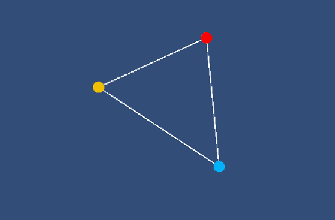

# toepassing: Vectoren optellen, aftrekken en scalair vermenigvuldigen

## Leerdoelen
Na deze les kun je:
- Laten zien dat je kan Werken met Unity input actions
- Laten zien dat je met Unity vectoren kan optellen, aftrekken en scalair vermenigvuldigen

---

## Opzetten van basis

We gaan eerst in Unity een basis opzetten, waarmee wij kunnen gaan werken met vectoren en matrices. Daarvoor hebben wij twee prefab-ojecten nodig:

1. Een draggable Point (een versleepbare punt)
2. Een triangle (driehoek) die uit drie draggable points bestaat

# draggable point

# triangle
