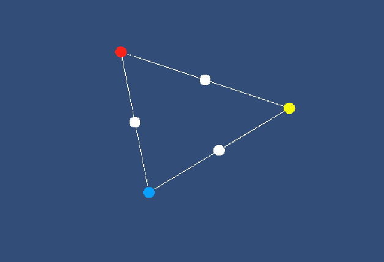

# toepassing: Vectoren toepassen

## Leerdoelen
Na deze les kun je:
- werken met vectoren in de praktijk
- vectorvoorstelling opstellen

## Het midden van de zijde
- Neem triangle ABC
- Noem hAB, hBC en hCA de middelpunten van de zijden
- Geef de vectorvoorstelling van hAB, hBC en hCA
- Pas deze vectorvoorstelling toe in Unity



## uitwerking
Als de positie van punt A aangegeven wordt met $ \vec {a} $ en de positie van punt B met $ \vec {b} $, dan geldt voor het midden van de zijde AB 

```` math
 \vec {a} + \frac{1}{2} ( \vec {b} - \vec {a} )
````
